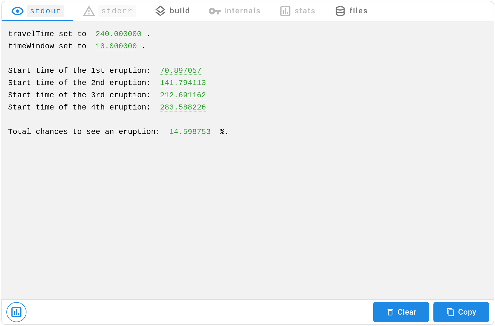
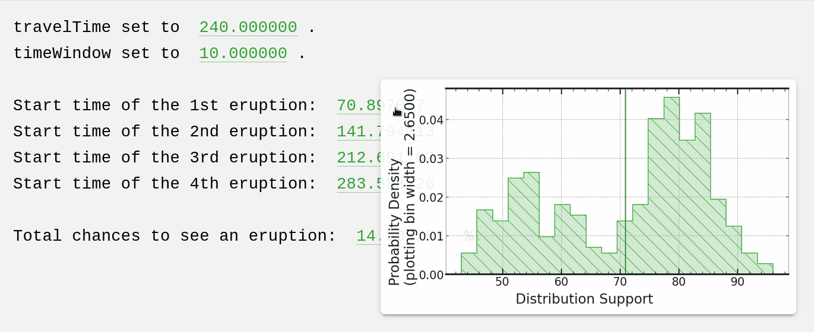
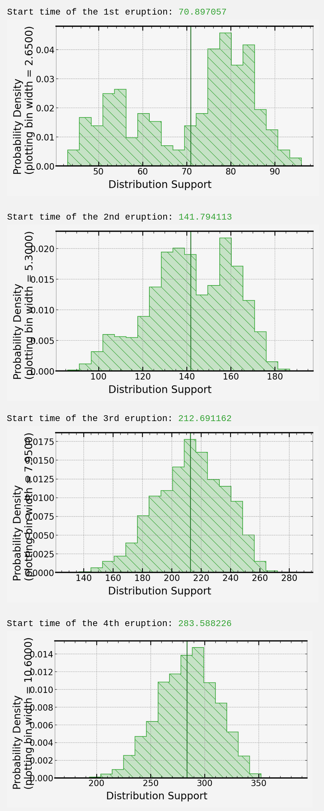

[](https://signaloid.io/repositories?connect=https://github.com/signaloid/Signaloid-Demo-General-OldFaithfulCentralLimit#gh-dark-mode-only)
[](https://signaloid.io/repositories?connect=https://github.com/signaloid/Signaloid-Demo-General-OldFaithfulCentralLimit#gh-light-mode-only)


# Old Faithful and the Central Limit Theorem

Here is an example that shows the evolution of a bi-modal distribution using the Old Faithful data set[^0].


## Scenario

You are in Yellowstone National Park in the US.
You will arrive to Old Faithful in `travelTime` and will stay there for `timeWindow`.
What are the chances that an eruption starts when you are there?

Run this program to find out! You can click on the "Add to signaloid.io" button at the beginning of the `README.md` to run this for yourself.


## How it Works

The [code](src/main.c) takes the waiting time for Old Faithful eruption and builds a distribution out of it.
By adding this distribution over and over, we model the starting time of eruptions.
We assume that each eruption comes from the same distribution but that they are independent.

Here is some pseudo-code that describes the program's core:
```c
float timeToNextEruption = 0.0;
float totalChancetoSeeEruption = 0.0;
while (true)
{
	timeToNextEruption += waitingTimeDistribution();
	totalChancetoSeeEruption += eruptionStartsInInterval(timeToNextEruption);
}
```
The code here has been simplified.
In the real program, the loop terminates.
Furthermore, for each iteration of the loop the program prints the `timeToNextEruption`.


## Interpreting the Output

The execution produces the output:



For each highlighted number, you can move your mouse pointer over the number to see the associated probability distribution.
For the first eruption, we see the bi-modal distribution corresponding to the time between two eruptions.



Alternatively, you can click on the bottom left to display all the distributions.
There we see something interesting!



Notice how the distribution changes over time.
At the beginning, it is clearly bi-modal and then it transform to look more and more like a normal distribution.
This does not happen by chance.
This is an illustration of a result known as the [central limit theorem](https://en.wikipedia.org/wiki/Central_limit_theorem).

### Caveat

The chances to see an eruption printed at the end is not a probability distribution.
We sum the chances across all the eruptions without checking for overlap.
For instance, if you set the `timeWindow` to a value large enough to see multiple eruptions, the chances can go over 100%!


[^0]: Härdle, W. (1991). Smoothing Techniques with Implementation in S. New York: Springer.
